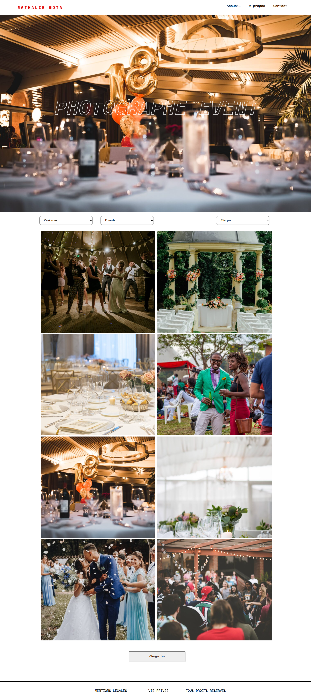

# 📸 Mota Photo — Thème WordPress sur mesure

Projet réalisé dans le cadre d’une mission freelance pour **Nathalie Mota**, photographe professionnelle spécialisée dans l’événementiel.  
L’objectif : reconstruire entièrement son site WordPress après la perte de sa précédente plateforme, en créant un **thème personnalisé** respectant les maquettes graphiques et les principes du **Green Code**.

---

## 🧩 Scénario client

Nathalie souhaitait un site :
- fidèle à ses **maquettes Figma** (versions desktop et mobile),
- **performant et éco-conçu**, avec des images optimisées,
- administrable facilement via le **back-office WordPress**.

Elle doit pouvoir :
- présenter ses **séries photo** dans des galeries thématiques,  
- permettre à ses clients de **consulter et commander des images**,  
- garder la liberté de modifier ses menus et contenus depuis WordPress.

---

## ⚙️ Stack technique
- **WordPress** (thème développé from scratch)
- **PHP**, **HTML5**, **CSS3**, **JavaScript (ES6)**  
- **Custom Post Types** via *CPT UI*  
- **Custom Fields** via *Smart Custom Fields (SCF)*  
- **Contact Form 7** pour la modale de contact  
- **Git / GitHub** pour la gestion de version  
- **Figma** pour la conception visuelle

---

## 🚀 Fonctionnalités principales
- **Modale de contact** dynamique (appelée depuis le footer)
- **Galerie de photos dynamique** avec filtres par catégorie et format  
- **Navigation gérée via le menu WordPress natif**  
- **Optimisation Green Code** : images compressées et lazy loading  
- **Responsive design complet** (desktop, tablette, mobile)  
- **Animations fluides** pour l’apparition et la navigation  

---

## 🧠 Ce que j’ai appris
- Création d’un thème WordPress complet et modulaire  
- Utilisation de `functions.php` pour enregistrer menus, scripts et CPT  
- Gestion de la modale de contact en JavaScript natif  
- Intégration de champs dynamiques via Smart Custom Fields  
- Application de bonnes pratiques d’éco-conception web  

---

## 📸 Aperçus

| Version desktop | Version mobile |
|-----------------|----------------|
|  | .png) |

> 💡 Captures issues de la version locale, réalisées en navigation privée sur Chrome DevTools (iPhone 12 Pro – 390×844).

---

## 📦 Installation locale (pour test)
1. Cloner ce dépôt  
2. Installer une instance WordPress locale (Local by Flywheel, Laragon, XAMPP, etc.)  
3. Copier le dossier du thème dans `wp-content/themes/mota/`  
4. Activer le thème **Mota Photo** depuis l’administration WordPress  
5. Installer les plugins nécessaires :  
   - CPT UI  
   - Smart Custom Fields  
   - Contact Form 7  

---

## 🌿 Principes Green Code appliqués
- Compression systématique des images (.jpg / .webp)  
- Lazy loading sur les galeries  
- Scripts JS minifiés et chargés conditionnellement  
- Requêtes API limitées pour réduire l’impact environnemental  

---
